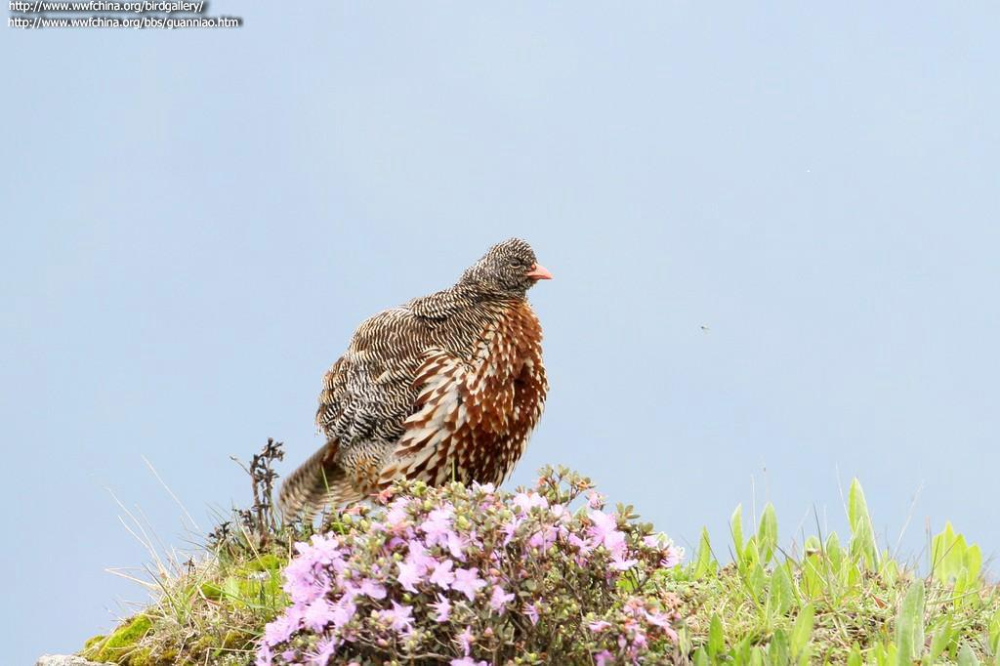

Title : skimage-portable-augmentation
Author : feedliu

[TITLE]
# Introduction
Skimage-portable-augmentation is a portable and parallel image augmentor, implemented by skimage(scikit-image) library. If you just want to make a augmentation, and give me a directory to get augmented images, this project actually is what you want.

# Examples

**```in_path```** should be the directory which contain all images, and each of subdirs denotes a class;\
**```out_path```** should be the output directory, and the output directory will have the same structure of subdirs with the in_path;\
**```num_thread```** should be the number of threads to process the augmentation;\
**```extension```** should be the extension to be used when generating new images;\
**```verbose```** should be a bool value to control whether to show the aumentation info.\

if you want to put new images in the in_folder, just ignore out_folder parameter
```python
#augmentor = ImageAugmentor("./images")
augmentor = ImageAugmentor("./images", num_thread=8, extension="jpg", out_folder="./augmentation", verbose=True)
augmentor.augmentation()
```

|Type           |Augmented Image                                                                                                                     ||
|--:------------|--:---------------------------------------------------------------------------------------------------------------------------------||
|original image |                                            |                                                                  |
|color inversion|                                                                                              ||
|exposure       |                                                                                                     ||
|gamma          |                                                                                                        ||
|log correlation|                                                                                              ||
|random noise   |                                                                                                 ||
|rescale        |                                                                                                      ||
|rgb2gray       |                                                                                                     ||
|rotate         | ||
|sigmoid correlation||                                                                  |

# Augmentation Types
- color inversion
- exposure
- gamma
- log correlation
- random noise
- rescale
- rgb2gray
- rotate
- sigmoid correlation

Every image will get 12 new images. If you want add new type, just open the file image_augmentation.py.
And add a new member function like this:
```python
def new_type(self, image):
    return new_operation(image)
```
Then add one new line at the end of function **```single_augmentation```**:
```python
self.__augmentation_and_save(self.new_type, name, img, out_folder)
```
It's OK.
